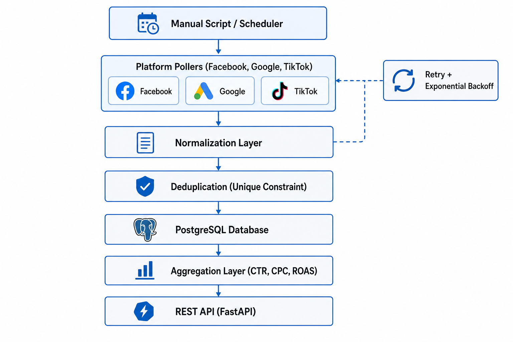

# Part 1 — System Design

## Architecture Diagram



## Overview

The system ingests ad performance data from multiple external platforms, normalizes it into a common schema, stores it with deduplication, and serves aggregated metrics through a REST API.

```text
Scheduler / Manual Script
        ↓
Platform Pollers (Facebook, Google, TikTok)
        ↓
Normalization Layer
        ↓
Deduplication (unique constraint)
        ↓
PostgreSQL
        ↓
Aggregation Layer
        ↓
REST API (FastAPI)
```

## Architectural Choices

**Separation of ingestion and query paths.** External ad APIs are slow, rate-limited, and unreliable. The REST API reads only from our database, so user-facing queries stay fast and stable even when upstream APIs fail.

**Platform-specific pollers.** Each ad platform uses different endpoints, authentication, pagination, and field names. Isolating that complexity in dedicated poller classes keeps the rest of the system platform-agnostic.

**Normalization before storage.** All platforms are mapped to one internal model (`platform`, `campaign_id`, `ad_id`, `date`, `impressions`, `clicks`, `spend`, `revenue`, etc.). This simplifies metric calculation, deduplication, and API filtering.

**PostgreSQL with a unique constraint** on `(platform, campaign_id, ad_id, date)` for idempotent ingestion. Re-fetching overlapping date ranges updates existing rows instead of creating duplicates.

## Reliability

- **Retries with exponential backoff** (tenacity) for 429 and 5xx responses and network timeouts
- **Rate-limit awareness** via conservative page sizes and retry handling on 429
- **Idempotent upserts** so repeated ingestion runs are safe
- **Structured logging** for observability during ingestion and API requests

## Scalability

For the take-home, ingestion is triggered manually via `scripts/ingest_facebook.py`. In production:

1. A **scheduler** creates fetch jobs per platform/campaign at different intervals
2. A **message queue** (SQS, RabbitMQ, Redis) buffers jobs and absorbs spikes
3. A **worker pool** processes jobs in parallel
4. **Raw responses** are stored in object storage or JSONB for reprocessing
5. An **analytics database** (PostgreSQL at medium scale; ClickHouse/BigQuery at large scale) serves queries
6. A **cache** (Redis) stores frequent aggregates for high QPS on `/api/performance`

To support thousands of API requests per second on the query layer: read replicas, pre-aggregated rollups, and caching — never call external ad APIs from the query path.

## Failure Handling

| Failure | Strategy |
|---------|----------|
| 5xx from mock API | Exponential backoff retry (up to 4 attempts) |
| 429 rate limit | Retry with backoff; respect platform limits |
| Network timeout | Retry; httpx timeout configured (30s) |
| Duplicate data | PostgreSQL `ON CONFLICT` upsert |
| Invalid API input | FastAPI validation → 400/422 with clear messages |

## Metric Aggregation Note

For `/api/performance`, aggregate metrics are computed from totals (not averages of row-level rates):

```text
average_ctr  = total_clicks / total_impressions
average_cpc  = total_spend / total_clicks
average_roas = total_revenue / total_spend
```

This is more accurate than averaging per-row CTR/CPC/ROAS values.
